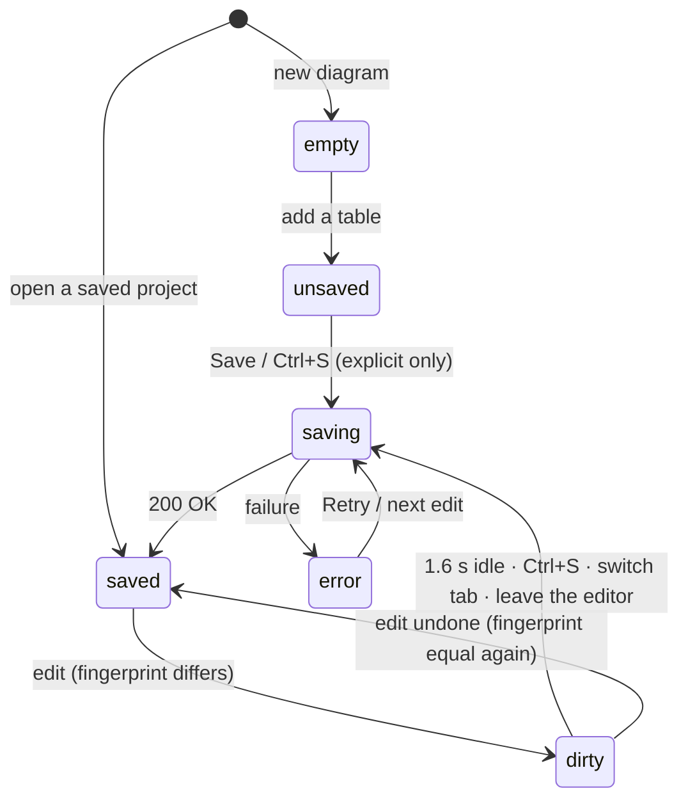
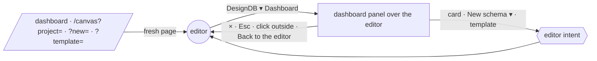

# Workspace dashboard & saving — architecture and UX

The project dashboard used to be a 640 × 500 px modal: a "New Blank Canvas" button, a "Save Current Design" button and
text-only cards. It is now a **large workspace panel over the editor**, modelled on dbdiagram.io's: up to
1360 × 880 px, centred, with the editor visible and dimmed around it. The whole screen on phones. **Saving moved into
the editor**, where the work happens. This document is the design record: architecture, wireframes, Tailwind guidelines
and the reasoning behind the save change. Everything described here is implemented.

(An earlier iteration made it a separate full-window page. It was changed to a panel on request, so the editor stays
put and opening a diagram happens right behind the panel.)

| | Where |
|---|---|
| Panel | `components/Dashboard/WorkspaceDashboard.tsx`, rendered by `AppLayout` when `layout.dashboard` is set (lazy chunk); `app/dashboard/page.tsx` only redirects to `/canvas?dashboard=<section>` |
| Pieces | `components/Dashboard/parts.tsx` (sidebar, action bar, dropdowns, empty states), `ProjectCard.tsx` (card, list row, thumbnail, ••• menu), `TemplatesView.tsx`, `IntentLink.tsx` |
| Opening things in the editor | `components/Canvas/editorIntent.ts` (`requestEditorIntent`, `intentHref`) → `runIntent` in `Canvas.tsx` |
| Project helpers (framework-free) | `src/lib/projects/index.ts` — metrics, search, sort, relative time, thumbnail geometry, save fingerprint |
| Saving | `src/hooks/useProjectSave.ts` (logic), `components/Layout/SaveIndicator.tsx` (top bar), `LayoutContext` (per-tab status) |
| API | `GET /api/projects`, `GET · DELETE · PATCH {title} · POST {action:"duplicate"} /api/projects/[id]`, `POST /api/projects/save` |
| Tests | `tests/projects.test.ts` |

---

## 1. Why "Save Current Design" in the dashboard was an anti-pattern

1. **Wrong place for the most frequent action.** You save far more often than you open or rename projects. It had to
   be reachable where you are, in one keystroke. The modal made you leave the diagram, open a list of *other* projects,
   and find a button there.
2. **The dashboard is about many projects; saving is about one.** A button that acts on "the current design" inside a
   screen listing all designs is ambiguous. Which design, and which tab? With several tabs open, the answer depended on
   hidden state.
3. **No feedback about state.** Nothing told you whether your work was saved, had unsaved changes, or failed to save.
   You only found out when something was lost.
4. **It mixed navigating with changing data.** Opening the dashboard to *look* at projects could turn into overwriting
   one. Management screens should be safe to browse.
5. **It doesn't scale.** A full-page dashboard has no "current design" at all: you reach it from anywhere, including a
   fresh browser tab with nothing open.

## 2. Where saving lives now (the editor)

```
┌─ top bar ─────────────────────────────────────────────────────────────────────────────────────────┐
│ ▣ DesignDB ▾ │ [✦ AI ◯━]  Import ▾  Export ▾  Share ▾  Tools ▾ │     [✓ Saved · 2 min ago]  ⚙ ? ● │
└───────────────────────────────────────────────────────────────────────────────────────────────────┘
                                                                 ▲ the save status — what state the diagram is in,
                                                                   and the one click that fixes it (= Ctrl+S)
```

| State | Looks like | Means / does |
|---|---|---|
| `empty` | muted "Not saved" | new diagram with nothing in it — nothing to save |
| `unsaved` | white **Save** button | never saved; the **first save is always deliberate** (click, Ctrl+S or DesignDB ▾ → Save) |
| `dirty` | amber dot "Unsaved changes" | a saved project changed; **autosaves 1.6 s after the last edit**; click saves now |
| `saving` | spinner "Saving…" | request in flight |
| `saved` | ✓ "Saved · 2 min ago" | matches what's on the server |
| `error` | red "Save failed · Retry" | the message is in the tooltip; click retries |



* **What counts as a change.** `saveSignature()` fingerprints what a save stores: the schema (via `modelSignature`),
  table and note positions, the view preferences kept in the project meta (collapsed groups, hidden colours, active view,
  relationship lines) and the title. Selecting, hovering and React Flow re-measuring nodes never count. Undoing back to
  the saved state returns to "Saved".
* **Per tab.** Each tab stores the fingerprint of its last save (`savedSig`), so switching tabs never loses the
  "unsaved" flag. Each save writes its status against *its* tab id, so a save finishing after you switched tabs, or after
  the editor unmounted, never shows up on another diagram.
* **Leaving is safe.**
  * Switching tabs saves the tab you left in the background if it has pending changes.
  * Leaving the editor page sends the pending save with `keepalive`. The canvas is kept in its tab, and tabs outlive
    the editor page, so coming back shows everything as it was, saved or not. (The dashboard panel doesn't leave the
    editor: it covers it, and the editor keeps working behind it.)
  * Closing the browser tab with anything unsaved asks first (`beforeunload`).
* **Autosave never creates projects.** Only a saved project autosaves. A never-saved diagram stays in its tab until you
  save it. A pending autosave is bound to its tab and is dropped if you switch away (the background save covers it).
* **Explicit saves** (Ctrl+S, the button, the menu) also record a snapshot in version history. Autosaves don't, so the
  history isn't flooded.

---

## 3. UX architecture

### Opening, closing, and what happens behind the panel

* **Open:** DesignDB ▾ → *Dashboard* or *My diagrams ▸ All diagrams…* (`layout.openDashboard(section)`), or the address
  `/dashboard` (redirects to `/canvas?dashboard=all|recent|templates`).
* **Close:** the **×** in the header, **Esc** (unless a menu, the search text or a rename wants it first), a click on the
  dimmed editor around the panel, or *Back to the editor* in the sidebar.
* **Everything opens in the editor right behind the panel, then the panel closes.** No page change: the dashboard sends
  an **editor intent** (`requestEditorIntent`) that `Canvas.runIntent` carries out:

| Intent | What the editor does |
|---|---|
| `{ project }` (a card) | Switches to its tab if already open. Otherwise it loads into the current tab if that tab is empty and never saved, or else into a new tab. It never overwrites the diagram you were working on. |
| `{ new: "blank" \| "import" \| "ai" }` | A new diagram, reusing an empty tab. Then the Import dialog or the AI chat opens. |
| `{ template }` | A copy of the template as a new diagram (replacing an empty, never-saved tab) |
| an open tab (sidebar) | switches to it |

Every such control is a real link (`IntentLink`). A plain click sends the intent. Middle-click or Ctrl/⌘-click opens the
same intent in a new browser tab through the URL: `/canvas?project=<id>` · `?new=…` · `?template=…`. The editor handles
the URL once and cleans it (`history.replaceState`), so reloading doesn't repeat it.



### State ownership

| State | Owner | Why |
|---|---|---|
| Saved projects | the server (`/api/projects`), fetched by the dashboard | one source of truth |
| Open tabs and their diagrams (+ `savedSig`, `savedAt`) | `LayoutContext` (root layout) | shared by the editor and the panel over it |
| Save status | `LayoutContext`, **per tab** | the top bar shows it; late saves can't mislabel another tab |
| Panel open / section | `LayoutContext.dashboard` (`"all" \| "recent" \| "templates" \| null`) | any part of the app can open it on a section |
| View (grid/list), sort | `localStorage` `designdb.dashboard` | personal preference |
| Search text, engine filter, renaming | component state | transient |

### Component hierarchy

```
AppLayout  (editor chrome)
└─ {layout.dashboard && <WorkspaceDashboard section onClose/>}   lazy chunk, loaded on first open
   └─ backdrop  fixed inset-0 z-[62] bg-black/55     click → close; keys stop here (never reach the editor)
      └─ panel  role="dialog" aria-modal, focused on open, 1360 × 880 max (full screen on phones)
         ├─ OpenInEditorContext  (intent → requestEditorIntent + close)
         ├─ Sidebar (≥ lg: fixed 248 px · below: drawer inside the panel)
         │   ├─ brand (DesignDB)
         │   ├─ Workspace: All diagrams (n) · Edited this week (n) · Templates
         │   ├─ Open in the editor: Back to the editor · open tabs ("not saved" marker)
         │   └─ "Free · no account needed" (no account, billing or team settings — out of scope)
         └─ main (scrolls)
             ├─ header (sticky, solid)
             │   ├─ title + counts          [NewSchemaButton: New schema | ▾ Blank · Import · AI · Template]  [×]
             │   └─ action bar: SearchBox (/) · Dropdown Engine · Dropdown Sort · ViewToggle
             └─ content
                 ├─ SkeletonGrid                       loading
                 ├─ error card + Try again             request failed
                 ├─ EmptyWorkspace + SampleStrip       zero diagrams (onboarding)
                 ├─ NoMatches                          search / filter / section has nothing
                 ├─ grid of ProjectCard                ProjectThumbnail · EngineBadge · metrics · ProjectMenu (•••)
                 ├─ list of ProjectRow                 same data, one line each
                 └─ TemplatesView                      category chips · template cards (lazy: parser + layout load on demand)
```

### Empty states

| Situation | What the page does |
|---|---|
| **No diagrams at all** | The page becomes onboarding: "Design your first database", three large tiles (**Blank canvas** highlighted, **Import SQL or DBML**, **Generate with AI**) and four sample templates with live thumbnails, plus "Browse all templates →". Search and filters are hidden, since there is nothing to search. |
| Search / filter finds nothing | "No diagrams match "invoices"", what search covers (names, table names, column names) and **Clear search** (also resets the engine filter) |
| "Edited this week" is empty | "No diagrams edited this week here yet" |
| Loading | skeleton cards in the chosen layout, so the page doesn't jump |
| API error | a card with the message and **Try again** |

---

## 4. Wireframes

### Desktop — the panel over the editor (1920 × 930: panel 1360 × 880, 4 columns)

```
 editor (dimmed) ───────────────────────────────────────────────────────────────────────────────────────────────────────
 ▒▒▒▒▒┌──────────────────┬─────────────────────────────────────────────────────────────────────────────────────┐▒▒▒▒▒▒
 ▒▒▒▒▒│ ▣ DesignDB       │ All diagrams                                            [+ New schema │ ▾ ]    [×] │▒▒▒▒▒▒
 ▒▒▒▒▒│──────────────────│ 12 diagrams · 3 edited this week                                                    │▒▒▒▒▒▒
 ▒▒▒▒▒│ WORKSPACE        │ [🔍 Search diagrams, tables and columns…       / ] [⏷ Engine All ▾] [Sort … ▾] [▦│☰] │▒▒▒▒▒▒
 ▒▒▒▒▒│ ▌📁 All diagrams │─────────────────────────────────────────────────────────────────────────────────────│▒▒▒▒▒▒
 ▒▒▒▒▒│  🕘 This week    │ ┌────────────────┐ ┌────────────────┐ ┌────────────────┐ ┌────────────────┐        │▒▒▒▒▒▒
 ▒▒▒▒▒│  ▦ Templates     │ │● Open    (•••) │ │          (•••) │ │          (•••) │ │          (•••) │        │▒▒▒▒▒▒
 ▒▒▒▒▒│                  │ │ ┌─┐──┐ ┌──┐    │ │ ┌──┐ ┌──┐      │ │   ┌──┐         │ │ ┌──┐           │        │▒▒▒▒▒▒
 ▒▒▒▒▒│ OPEN IN THE      │ │ └─┘  └─┤  │    │ │ └──┴─┤  │ ┌─┐  │ │ ┌─┤  ├─┐ ┌──┐ │ │ └──┘ ┌──┐      │        │▒▒▒▒▒▒
 ▒▒▒▒▒│ EDITOR           │ ├────────────────┤ ├────────────────┤ ├────────────────┤ ├────────────────┤        │▒▒▒▒▒▒
 ▒▒▒▒▒│  ▭ Back to the   │ │E-commerce Store│ │Clinic          │ │Blog / CMS      │ │CRM             │        │▒▒▒▒▒▒
 ▒▒▒▒▒│    editor        │ │2 h ago [PG]    │ │yesterday [MySQL│ │Sep 7 [Any SQL] │ │Sep 2 [PG]      │        │▒▒▒▒▒▒
 ▒▒▒▒▒│    E-commerce…   │ │▦ 10 ⑂ 13       │ │▦ 7 ⑂ 8         │ │▦ 8 ⑂ 9         │ │▦ 9 ⑂ 11        │        │▒▒▒▒▒▒
 ▒▒▒▒▒│    Untitled  not │ └────────────────┘ └────────────────┘ └────────────────┘ └────────────────┘        │▒▒▒▒▒▒
 ▒▒▒▒▒│          saved   │                                                                                     │▒▒▒▒▒▒
 ▒▒▒▒▒│ ┌──────────────┐ │ (card hover: lifts 2 px, blue border; ••• appears; a click opens it in the editor   │▒▒▒▒▒▒
 ▒▒▒▒▒│ │Free · no acct│ │  behind and closes the panel)                                                      │▒▒▒▒▒▒
 ▒▒▒▒▒│ └──────────────┘ │                                                                                     │▒▒▒▒▒▒
 ▒▒▒▒▒└──────────────────┴─────────────────────────────────────────────────────────────────────────────────────┘▒▒▒▒▒▒
 ─ click the dimmed editor, press Esc or × to close ────────────────────────────────────────────────────────────────────
```

### Card context menu (•••)

```
                        ┌───────────────────────┐
                        │ ↗ Open in editor       │
                        │ ✎ Rename               │   inline — Enter saves, Esc cancels (PATCH, no content resent)
                        │ ⧉ Duplicate            │   → "… (Copy)" appears first in the grid
                        ├───────────────────────┤
                        │ ⤓ Export SQL           │   in the diagram's own engine (PostgreSQL when unset)
                        │ ⤓ Export DBML          │
                        ├───────────────────────┤
                        │ 🗑 Delete               │   → "You're deleting diagram E-commerce Store. Are you sure?"
                        └───────────────────────┘
```

### List view

```
      NAME                              ENGINE        CONTENTS                   EDITED
[▭]   E-commerce Store  ●               [PostgreSQL]  ▦ 10 tables  ⑂ 13 refs     2 hours ago     (•••)
[▭]   Clinic Scheduling                 [MySQL]       ▦ 7 tables   ⑂ 8 refs      yesterday       (•••)
```

### Mobile (< 1024 px sidebar becomes a drawer · < 640 px one column)

```
┌───────────────────────────────┐
│ ☰  All diagrams      [+ New│▾] │
│    12 diagrams                │
│ [🔍 Search…                 /] │
│ [Engine All ▾] [Sort … ▾]     │
│ [▦│☰]                         │
│┌─────────────────────────────┐│
││ thumbnail              (•••)││   ••• always visible (no hover on touch)
│├─────────────────────────────┤│
││ E-commerce Store            ││
││ Edited 2 hours ago ·[PG]    ││
│└─────────────────────────────┘│
└───────────────────────────────┘
```

### Empty workspace

```
                       [▣]
             Design your first database
  Start from scratch, bring a schema you already have, or let AI draft one.
 ┌───────────────────┐ ┌───────────────────┐ ┌───────────────────┐
 │ [+] Blank canvas  │ │ [⤒] Import SQL or │ │ [✦] Generate with │
 │ An empty diagram  │ │ DBML — PostgreSQL,│ │ AI — review the   │
 │ (highlighted)     │ │ MySQL, Prisma…    │ │ schema first      │
 └───────────────────┘ └───────────────────┘ └───────────────────┘
 OR OPEN A SAMPLE                                   Browse all templates →
 [E-commerce]  [Blog / CMS]  [SaaS Multi-tenant]  [CRM]      (live thumbnails)
```

---

## 5. Tailwind layout & component guidelines

### Panel shell

```tsx
{/* the backdrop: the dimmed editor — a click on it closes; key events stop here, so the editor never sees them */}
<div className="fixed inset-0 z-[62] flex items-center justify-center sm:p-5 bg-black/55"
     onPointerDown={(e) => e.target === e.currentTarget && onClose()}
     onKeyDown={(e) => { e.stopPropagation(); if (e.key === "Escape" && !e.defaultPrevented) onClose(); }}>
 <div role="dialog" aria-modal="true" tabIndex={-1}                                       {/* focused on open */}
      className="relative flex w-full h-full sm:w-[min(1360px,100%)] sm:h-[min(880px,100%)] bg-[#070b14]
                 sm:rounded-2xl border border-white/[0.1] shadow-[0_30px_90px_rgba(0,0,0,0.75)] overflow-hidden">
  <aside className="hidden lg:block w-[248px] shrink-0 h-full">{sidebar}</aside>            {/* drawer below lg */}
  <div className="flex-1 min-w-0 h-full overflow-y-auto p-scrollbar">                         {/* the panel scrolls here */}
    <header className="sticky top-0 z-20 bg-[#070b14] border-b border-white/[0.06]">         {/* solid, no blur */}
      <div className="max-w-[1600px] mx-auto px-4 sm:px-6 lg:px-8 pt-5 pb-4 space-y-4">…</div>
    </header>
    <main className="max-w-[1600px] mx-auto px-4 sm:px-6 lg:px-8 py-6">…</main>
  </div>
 </div>
</div>
```

The panel is solid (no translucency) and appears instantly (no animation). The size mirrors dbdiagram.io's workspace
panel: at 1920 × 930 it sits at 280, 25 and measures 1360 × 880, leaving the editor visible around it.

### Responsive grid: 1 → 2 → 3 → 4 columns

```tsx
<div className="grid grid-cols-1 sm:grid-cols-2 xl:grid-cols-3 2xl:grid-cols-4 gap-5">
```

| Viewport | Sidebar | Content width | Columns |
|---|---|---|---|
| < 640 px (`sm`) | drawer | full | 1 |
| 640–1279 px | drawer below 1024 px, then fixed | ≈ 600–1000 px | 2 |
| 1280–1535 px (`xl`) | fixed 248 px | ≈ 1000–1250 px | 3 |
| ≥ 1536 px (`2xl`) | fixed 248 px | ≤ 1600 px (capped) | 4 |

Cards keep a 260–380 px width across these steps. For content areas whose width doesn't follow the viewport (a future
split view, say), use `grid-cols-[repeat(auto-fill,minmax(260px,1fr))]` instead of breakpoints.

### Design tokens

| Token | Value | Used for |
|---|---|---|
| Page background | `#070b14` | page, sticky header |
| Sidebar | `#0a0f1b` + `border-r border-white/[0.06]` | navigation |
| Surface | `#0e1524` | cards, inputs, dropdown buttons |
| Surface (raised) | `#0c1322` | menus, dropdown lists |
| Thumbnail well | `#0a101c` + 14 px dot grid `rgba(255,255,255,.06)` | card previews |
| Border | `white/[0.07]` (rest) → `white/[0.16]` (hover, controls) | |
| Accent | `#4A90D9` (brand blue) · text `#7fb3ee` | active nav, focus rings, "matches…" |
| Primary action | `bg-gradient-to-b from-[#3a82dc] to-[#1d5fb1]`, `border-[#5b9be6]/40`, `shadow-[0_6px_18px_rgba(29,95,177,0.35)]` | New schema (same blue as the editor's top bar) |
| Danger | `text-red-300`, `hover:bg-red-500/10`; confirm button `bg-red-500` | Delete |
| Text | `text-white` titles · `white/50–55` metadata · `white/30–40` hints and headings | |
| Radius | `rounded-2xl` (16 px) cards · `rounded-xl` (12 px) controls, menus · `rounded-lg` (8 px) items, buttons | |
| Shadow (rest) | `0 8px 24px rgba(0,0,0,.25)` + 1 px inner top highlight | card |
| Shadow (hover) | `0 16px 40px rgba(0,0,0,.45)` + `0 0 0 1px rgba(74,144,217,.15)` | card |
| Shadow (menus) | `0 18px 50px rgba(0,0,0,.6)` | ••• menu, dropdowns, split menu |
| Motion | `transition-all duration-200`; hover `-translate-y-0.5`; thumbnail `group-hover:scale-[1.03]` over 300 ms | cards |
| Focus | `focus-visible:ring-2 focus-visible:ring-[#4A90D9]/70` | stretched card links, inputs (`ring-[#4A90D9]/20` + border) |

Popovers and menus are **solid** (no translucency or backdrop blur), consistent with the editor's menus.

### Card anatomy (grid)

```
data-card · relative · rounded-2xl · bg-[#0e1524] · border-white/[0.07]
├─ <Link> absolute inset-0 z-10              ← the whole card opens the diagram (keyboard: Tab + Enter)
├─ thumbnail  aspect-[16/10] · overflow-hidden · dot grid
│   ├─ <svg viewBox> groups (dashed, tinted) · relationship curves (lineage dashed amber) · tables (header colour, row bars) · notes
│   └─ "● Open in editor" chip             ← when a tab has it open
├─ ••• button  absolute right-2.5 top-2.5 z-20  (hover-revealed ≥ sm, always visible on touch)
└─ body px-4 pt-3 pb-3.5
    ├─ title (truncate; becomes an input while renaming)
    ├─ "Edited 2 hours ago" · EngineBadge (PostgreSQL / MySQL / SQLite / SQL Server / Oracle tints; "Any SQL" when unset)
    ├─ "Matches column orders.shipping_address_id"   ← only for content matches
    └─ ▦ tables · ⑂ relationships · ◫ views (when any)
```

* **Stretched link + an actions button on top** keeps the markup valid (no button inside an `<a>`) and gives one big
  target.
* **Thumbnails are drawn, not screenshotted.** `thumbnailOf()` turns the saved node positions into rectangles and curves
  (`vector-effect: non-scaling-stroke` keeps hairlines crisp at any zoom). It is memoised per project.
  `estimateNodeSize` lives in `lib/nodeSize.ts`, so the dashboard doesn't load the layout engine (dagre).

### Accessibility

* The panel is a modal dialog (`role="dialog" aria-modal`), focused when it opens; focus returns to where it was when
  it closes. Keys typed in it never reach the editor behind. If focus falls out of the panel (a menu that had it
  closed), the next key is kept from the editor too, and focus returns to the panel. Delete / Backspace deletion is off
  on the canvas while the panel is open.
* Landmarks: `<nav aria-label="Dashboard">`, one `<h1>` per section, `aria-current="page"` on the active section.
* Menus: `role="menu"` / `menuitem`; the first item takes focus; Esc and outside clicks close them (capture
  `pointerdown`).
* Dropdowns are `role="listbox"` with `aria-selected`. The view toggle uses `aria-pressed`, the split button
  `aria-haspopup` / `aria-expanded`.
* Keyboard: <kbd>Esc</kbd> closes the panel. Menus, a non-empty search and a rename take it first. <kbd>/</kbd> focuses
  search; <kbd>Esc</kbd> clears it; <kbd>Enter</kbd> / <kbd>Esc</kbd> finish or cancel
  a rename; confirmations take <kbd>Enter</kbd> / <kbd>Esc</kbd>.
* The save status uses `aria-live="polite"`.

---

## 6. Behaviour details

* **Search** matches the diagram name, then table names, then column names (case-insensitive). A content match says
  where it matched on the card.
* **Engine filter** lists the engines present in your diagrams (from the DBML `Project { database_type }`), plus
  "Not set".
* **Sort**: Last modified (default) · Name (A–Z, natural: "Diagram 9" before "Diagram 10") · Recently created · Most
  tables. The sort and the grid/list view persist.
* **Rename** of a diagram that is open in the editor also updates its tab and its saved fingerprint, so autosave doesn't
  write the old name back.
* **Delete** of a diagram that is open in the editor turns its tab into an unsaved copy, so autosave can't quietly
  re-create it. The confirmation says so.
* **Opening** uses real links (`IntentLink`, `/canvas?project=…`): a click opens the diagram in the editor behind the
  panel; middle-click and "open in new browser tab" start a fresh editor on it.

## 7. Scope and known limitations

* No accounts, billing, teams or sharing permissions. DesignDB is free and single-user (see `FEATURES.md`). The
  sidebar says so instead of showing empty settings.
* `GET /api/projects` returns full diagrams (the cards derive metrics and thumbnails from them). This is fine for local
  use and dozens of diagrams. For hundreds, add a summary endpoint (id, title, dates, counts, precomputed thumbnail
  geometry).
* Thumbnails use saved positions and estimated table sizes (like exports), not the live measured sizes.
* Open tabs live in memory: a full page reload starts with a fresh editor. Saved diagrams are safe, and the
  `beforeunload` prompt protects unsaved ones.
