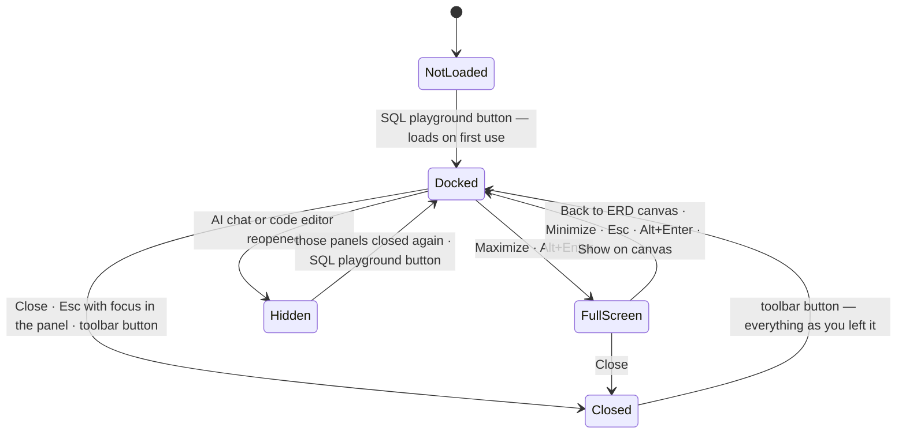

# SQL Playground — architecture & UX

A live SQLite database built from the diagram, for testing queries against a design without leaving it. SQLite runs
as WebAssembly (sql.js) in a Web Worker, seeded with sample rows; nothing leaves the browser.

It has two stages: a **docked panel** under the canvas (the default) and a **full-screen, three-pane IDE** on demand.
Both are the same mounted component — only its CSS changes — so switching never loses the editor's text, cursor,
selection, undo history or scroll position.

| Where | What |
|---|---|
| `frontend/src/lib/sandbox/engine.ts` | Framework-free engine: builds the database, runs SQL, derives the schema tree. Tested in `tests/sandbox.test.ts` against real SQLite. |
| `frontend/src/components/Canvas/SqlSandbox.tsx` | The shell: stages, header, resizing, keyboard, engine lifecycle. |
| `frontend/src/components/Canvas/sandbox/SqlEditor.tsx` | CodeMirror 6 + `@codemirror/lang-sql` (SQLite dialect), schema-aware completion. |
| `frontend/src/components/Canvas/sandbox/SchemaTree.tsx` | Schema inspector: tables, columns, types, keys; click / drag to insert. |
| `frontend/src/components/Canvas/sandbox/ResultsPanel.tsx` | Status line, result-set tabs, data grid, error and empty states. |
| `frontend/src/components/Canvas/sandbox/runtime.ts` + `playground.worker.ts` | Web Worker host (main-thread fallback), Stop = restart the worker. |

---

## 1. UX architecture & interaction flow

### States



* **Not loaded → Docked.** Nothing of the playground (its JavaScript chunk, CodeMirror's SQL support, the WebAssembly
  engine) is downloaded until it is first opened. The first open builds the database and fills a fresh editor with a
  starter query: a `SELECT` on the first table and a `JOIN` along one of the diagram's relationships.
* **Docked ↔ Closed.** Closing only hides the panel. The editor, the results and the database — including rows you
  inserted or changed — are all still there when you reopen it.
* **Docked ↔ Full screen.** Instant, no animation. The editor keeps focus across the switch.
* **Side panels fold away.** Result sets are wide, so the docked playground always gets the canvas' full width:
  opening it collapses the AI chat and the DBML / SQL code editor. Nothing is unmounted — the conversation, a
  half-typed AI message, the editor's text, cursor, selection and undo history are exactly as they were. Closing the
  playground slides back out whichever panels it folded away, in the mode they were in (split or full screen).
* **Docked → Hidden.** Reopening the AI chat or the code editor while the playground is open gives that panel the room
  back: the playground is hidden, not closed (nothing is lost), and the bottom-bar SQL button stays lit — its tooltip
  says it is hidden. Closing the side panel(s) brings it back. So does clicking the SQL button, which folds the panels
  away again and remembers them for when the playground closes. A panel reopened by hand is the user's: closing the
  playground afterwards leaves it as it is.

What survives each transition:

| | Close → reopen | Docked ↔ full screen | Re-sync schema | Stop |
|---|---|---|---|---|
| Editor text, cursor, selection, undo, scroll | kept | kept | kept | kept |
| Last results | kept | kept | kept | cleared |
| Database contents (your INSERT / UPDATE / DELETE) | kept | kept | **rebuilt from the diagram** | **rebuilt from the diagram** |
| Canvas zoom & pan | kept | kept (canvas stays mounted underneath) | — | — |
| AI chat & code editor (folded away on open) | slide back out on close | — | — | — |
| Dock height | kept (and remembered in this browser) | — | — | — |

### Keyboard

| Keys | Where | Does |
|---|---|---|
| `Ctrl/⌘ + Enter` | editor | Runs every statement — or only the selected SQL (the button then reads *Run selection*). |
| `Alt + Enter` | panel focused, or full screen | Toggles docked ↔ full screen. |
| `Esc` | anywhere in full screen | Back to the docked panel. |
| `Esc` | focus inside the docked panel | Closes it. Esc on the canvas never closes the playground. |
| `Ctrl + Space` | editor | Autocomplete: keywords, tables (with column counts), `table.` → columns with types. |
| `↑ / ↓` (`Shift` ×80px), `Home`, `End` | resize handle (focusable) | Resizes the docked panel; double-click resets it to 35%. |

Esc is resolved innermost-first: an open autocomplete list, the editor's search panel, a non-empty tree filter or a
text selection (Esc first collapses it) consume it before the playground sees it. Typing `?` inside the editor is text — it no longer
opens the shortcuts sheet.

### Edge cases

| Situation | Behaviour |
|---|---|
| **Syntax error** (`SELEC * …`) | Statements run one at a time; execution stops at the failing one. Only that statement is underlined in the editor (hover shows the message); the results show *Statement 2 · line 3* with **Show in editor**, and results from the statements before it. |
| **Runtime error** (constraint, missing table) | Same, pointing at the statement that failed at run time. |
| **Big results** | 1,000 rows are kept for the grid ("Showing the first 1,000 rows"); counting stops at 100,000 rows. |
| **Runaway query** (`WITH RECURSIVE …` without a limit, a huge cross join) | The canvas stays responsive (the query runs in the worker). After 0.6 s the Run button becomes **Stop**: the worker is terminated and the database rebuilt from the diagram. Long row-producing queries also stop themselves after 20 s. |
| **The diagram changes while the playground is open** | The schema tree and autocomplete update live. The database does not rebuild by itself (that would discard your test rows): the header shows **Diagram changed · Re-sync**, and new tables / columns carry an amber dot in the tree until you do. |
| **DDL SQLite rejects** (a CHECK or DEFAULT written for another database) | The table is still created, without that constraint; a **notes** badge in the header lists what was left out. Circular foreign keys (which SQLite can't add after CREATE TABLE) are left out with a note. |
| **Sample rows that violate the design** (your DBML Records) | Skipped and listed in the notes. |
| **Empty diagram** | The tree says so; the editor says "Add tables to your diagram, then Re-sync schema"; `SELECT sqlite_version()` still works. |
| **Engine fails to load** (WASM blocked) | Error card with the reason and **Try again**. Workers unavailable → the same engine runs on the main thread (with a 5 s limit). |
| **Canvas zoom / pan** | Never reset. Opening, resizing or closing the docked panel keeps the diagram's *visual centre* in place (React Flow would otherwise stay pinned top-left and push the diagram under the panel). Full screen keeps the canvas mounted, so its viewport is exactly as you left it. |
| **Responsive** | Dock height: 35% of the window by default, clamped to [200px, window − 300px] and re-clamped when the window resizes. The schema pane hides itself when the panel is narrower than 860px (docked) / 720px (full screen) — the header toggle brings it back. A docked panel narrower than ~620px (a narrow window) stacks the editor over the results; below 640px the header drops its text labels. |
| **Other panels** | The AI chat and the code editor fold away while the docked playground is on screen and slide back when it closes; reopening one hides the playground until it is closed again (see *States*). The Inspect drawer, dashboard and AI audit close it, as before. |

---

## 2. UI component schema & wireframes

### Component tree

```
Canvas  (flex column)
├─ canvas area  (flex-1, min-h-0 — shrinks when the playground docks)
│   └─ React Flow · bottom toolbar · minimap   ← anchored to the canvas area, so they rise with it
└─ SqlSandbox   (next/dynamic — loaded on first open, then kept mounted)
    ├─ resize handle                     docked only
    ├─ header        Back to ERD canvas (full) · title · SQLite · WebAssembly · sync chip · notes ·
    │                schema toggle · Re-sync · ⤢ / ⤡ · ✕
    └─ body
        ├─ SchemaTree                    filter · tables ▸ columns · preview rows · show on canvas
        └─ main        (row when docked and wide, column otherwise)
            ├─ SqlEditor                 CodeMirror 6 + lang-sql, floating Run / Stop button
            ├─ splitter                  drag · double-click resets
            └─ ResultsPanel              status · result-set tabs · Copy (TSV) · grid
```

### Stage 1 — docked (default)

```
┌──────────────────────────────────── top navbar ─────────────────────────────────────┐
│▸ canvas — full width: the AI chat and the code editor fold away (▸ = editor tab)    │
│              ┌ customers ┐              ┌ orders ────┐                              │
│              │ id  email │ ───────────< │ customer_id│                              │
│              └───────────┘              └────────────┘                        [🗺]  │
│                  [ ⇆ ⤳ ▤ ✦ │ ↶ ↷ │ − 100% + ⤢ │ Detail level 👁 ▾ ]                 │
├═════════════════════════════════ ⠿ drag to resize ══════════════════════════════════┤
│ ▣ SQL Playground [SQLite · WebAssembly] ✓ In sync                ◧ ⟳ Re-sync  ⤢  ✕  │
├────────────────┬──────────────────────────────┬─────────────────────────────────────┤
│ SCHEMA  7      │ 1 SELECT *                   │ ✓ 5 rows · 1.2 ms           ⧉ Copy  │
│ [🔍 Filter  ]  │ 2 FROM orders AS c           │ ┌─#─┬─id─┬─status──┬─customer_id─┐  │
│ ▸ customers 4  │ 3 JOIN customers AS p        │ │ 1 │ 1  │ pending │ 3           │  │
│ ▾ orders    4  │ 4   ON p.id = c.customer_id  │ │ 2 │ 2  │ paid    │ 1           │  │
│  🔑 id   int   │ 5 LIMIT 10;                  │ │ 3 │ 3  │ shipped │ 2           │  │
│  🔗 cust… int  │              [▶ Run  Ctrl ↵] │ └───┴────┴─────────┴─────────────┘  │
└────────────────┴──────────────────────────────┴─────────────────────────────────────┘
```

### Stage 2 — full-screen IDE

```
┌───────────────────────────────────────────────────────────────────────────────────────┐
│ [← Back to ERD canvas] │ ▣ SQL Playground [SQLite · WebAssembly] ✓ In sync  ⚠ 1 note     │
│                                                   ◧   ⟳ Re-sync schema   ⤡   ✕         │
├───────────────────┬───────────────────────────────────────────────────────────────────┤
│ SCHEMA   7 tables │  1  -- SQLite, in your browser, seeded with sample rows …          │
│ [🔍 Filter …     ]│  2  SELECT c.full_name, COUNT(o.id) AS orders                      │
│ ▾ customers     4 │  3  FROM customers AS c                                            │
│   🔑 id   integer │  4  LEFT JOIN orders AS o ON o.customer_id = c.id                  │
│   · email  NN UQ  │  5  GROUP BY c.full_name;                   ~~~~~ error underline  │
│   · full_name  NN │                                               [▶ Run   Ctrl ↵]     │
│ ▸ orders        4 ├──────────────────────────── ⠿ drag to resize ─────────────────────┤
│ ▸ order_items   3 │ ✓ 5 rows · 2 statements · 1.4 ms     [Result 1 5][Result 2 5] ⧉   │
│ ▸ core.products 3 │ ┌─#─┬─full_name─────┬─orders─┬─ … wide results scroll sideways ─┐ │
│ ▸ core.products_  │ │ 1 │ Alice Smith   │      1 │   (sticky header + row numbers)  │ │
│   tags   N:M    2 │ │ 2 │ Bob Johnson   │      1 │                                  │ │
│                   │ └───┴───────────────┴────────┴──────────────────────────────────┘ │
└───────────────────┴───────────────────────────────────────────────────────────────────┘
```

### Tailwind layout (three-pane full screen)

One `<section>`; the stage only swaps its classes, so the editor is never unmounted.

```tsx
<section
  role={full ? "dialog" : "region"}
  aria-modal={full || undefined}
  className={full ? "fixed inset-0 z-[70] flex flex-col bg-[#0b0f18]" /* above navbar, AI and code panels */
                  : "relative shrink-0 flex flex-col border-t border-white/[0.1]"}   /* in the canvas' flex column */
  style={full ? undefined : { height: dockHeight }}
>
  {!full && <div role="separator" className="absolute -top-[5px] inset-x-0 h-[10px] cursor-row-resize" />}

  <header className="h-12 shrink-0 flex items-center gap-2 px-3 border-b border-white/[0.08]">…</header>

  <div className="flex-1 min-h-0 flex">                                   {/* body */}
    <aside className="w-[272px] shrink-0 min-h-0 border-r border-white/[0.07]">{/* SchemaTree */}</aside>

    <div className={`flex-1 min-w-0 min-h-0 flex ${vertical ? "flex-col" : "flex-row"}`}>
      <div className="relative min-w-0 min-h-0" style={{ flex: `0 0 ${editorShare}%` }}>
        {/* SqlEditor — CodeMirror fills it */}
        <div className="absolute bottom-3 right-4">{/* Run / Stop */}</div>
      </div>
      <div role="separator" className={vertical ? "h-[5px] cursor-row-resize" : "w-[5px] cursor-col-resize"} />
      <div className="flex-1 min-w-0 min-h-0">
        {/* ResultsPanel: h-9 status bar + a flex-1 overflow-auto grid;
            <thead> cells are sticky top-0, the row-number column sticky left-0 */}
      </div>
    </div>
  </div>
</section>
```

The `min-h-0` / `min-w-0` on every flex child is what lets the editor and the grid scroll inside their panes instead of
stretching the page. The canvas area next to the docked section is `flex-1 min-h-0`, which is why it shrinks rather
than being covered.

The side-panel rules live in `Canvas.tsx` (the SQL toggle registered with `LayoutContext`, plus two effects): a ref
records which panels the playground folded away, and `sandboxSuspended` hides it (`isOpen={showSqlSandbox &&
!sandboxSuspended}`) while a panel is back out. That only works because neither panel unmounts when collapsed:
`AppLayout` keeps `AiPanel` mounted (hidden) once opened, and `SQLCodePanel` keeps its split-mode tree mounted
(`hidden`) behind the edge tab.

---

## 3. Technical integration

### Where the schema comes from

```
React Flow nodes + edges + meta.enums
        │  useLiveModel()  — rebuilt only when table data / relationships / enums change
        ▼
DiagramModel (canvasToModel)
        │  resolvedSchema()  — the exporter's own resolution: N:M junction tables, child → parent FKs
        ├──────────────────────────────► playgroundTables()   → schema tree + autocomplete   (main thread, live)
        └── postMessage({ type: "build", model }) ──► Web Worker
                                               buildDatabase(): modelToSql(model, "sqlite")
                                               + sample rows → in-memory SQLite
```

* **What you query is what you export.** The database is created from exactly the DDL that *Export → SQL → SQLite*
  produces (`modelToSql`), so keys, NOT NULL / UNIQUE / CHECK constraints, enum checks, indexes and the junction
  tables of many-to-many relationships are all there. `core.orders` becomes `core_orders`, as in the export.
  Foreign keys are enforced (`PRAGMA foreign_keys = ON` after seeding), including the relationship's
  `ON DELETE / ON UPDATE` actions.
* **Sample rows.** A table's own DBML `Records` / sample data are used when it has them; otherwise five rows are
  generated: foreign keys point at real parent rows (composite keys consistently), self-references start from a root
  row, enum columns use the enum's values, unique columns never repeat, and values follow column names and types
  (emails, names, prices, dates, UUIDs, JSON…).
* **Staleness.** `databaseSignature(model)` — tables, relationships, enums and sample rows, but not positions, colours
  or notes — is recorded when the database is built. When the live signature differs, the header offers
  *Diagram changed · Re-sync*; comparing table / column keys marks what is new in the tree.

### Keeping the canvas at zero cost

The playground never writes to the canvas' state, and the canvas never re-renders because of it.

| Technique | Why |
|---|---|
| **The editor is uncontrolled.** CodeMirror owns the text; the playground reads it only when running. | Typing causes no React render at all — only "is something selected" flips re-render the Run label. |
| **Structural memo of the diagram.** `useLiveModel` compares the table `node.data` / `edge.data` *references*. React Flow keeps them identical when you drag or select. | Dragging a table costs one shallow array comparison; the model, tree and autocomplete are rebuilt only when the schema really changes. |
| **SQLite in a Web Worker.** Build and run are messages (`build`, `run`), processed in order. | A heavy query can't drop a single canvas frame, and Stop is simply `worker.terminate()` + rebuild. |
| **Capped payloads.** At most 1,000 rows come back per result set. | Structured-cloning results stays cheap. |
| **Memoised boundaries.** `SqlSandbox`, `SqlEditor`, `SchemaTree` and `ResultsPanel` are `memo` with stable callbacks. | Canvas renders don't cascade into the playground and vice versa. |
| **Lazy chunk.** `next/dynamic` on first open; the WASM is fetched by the worker. | `/canvas` first-load JS is 287 kB — slightly less than before the redesign (290 kB), since even the old sandbox is now off the initial path. |
| **Layout, not state, for docking.** The panel is a flex sibling of the canvas area. | React Flow sees a container resize — no props change on the canvas. The only code on the canvas side keeps the viewport centred (one `setViewport` per frame while the height changes). |

### State management recommendation

No global store (Zustand) and no new React Context. The playground's state has a single owner, and the only thing it
shares is the diagram it reads (props) and one command it sends (`layout.getCanvasApi().focusTable()` for *Show on
canvas*). A store would add a subscription surface with no second consumer, and putting editor text into React state
(Context or store) is exactly what would make typing re-render things.

If a future feature needs the playground from elsewhere — say, the AI panel explaining the last result — expose a
narrow imperative API through `LayoutContext` (like the existing `CanvasApi`: `getLastResult()`, `run(sql)`), not a
shared reactive store.

### Worker protocol

```ts
type WorkerRequest =
  | { id: number; type: "build"; model: DiagramModel }        // (re)create the database
  | { id: number; type: "run"; sql: string; offset: number }; // offset: where a run selection starts in the editor
type WorkerResponse =
  | { id: number; ok: true; report?: BuildReport; outcome?: RunOutcome }
  | { id: number; ok: false; error: string };
```

`RunOutcome` carries every result set (columns, rows, total, truncated), the statement count, rows affected, the time,
an optional notice (row / time limit) and, on failure, `{ message, statementIndex, from, to }` — the source range of
the failing statement, found with SQLite's prepare "tail" (sql.js `iterateStatements`), shifted by `offset` so the
editor can underline it.

### Tests

`tests/sandbox.test.ts` runs the engine against real SQLite (sql.js under Node): the schema mirrors the export
(flattened schemas, junction tables, refs, enums), every table is created with consistent sample rows, the design's
constraints and foreign keys are enforced (including `ON DELETE CASCADE`), DDL SQLite rejects degrades with a note,
errors point at the right statement (with and without an offset), runaway queries stop, and the staleness signature
ignores layout but not structure or sample rows.

### Known limitations

* It is SQLite: SQL written for your target database (PostgreSQL arrays, `ILIKE`, stored procedures…) may not run as
  is. The engine badge's tooltip says which database the diagram targets.
* Dragging the panel's top edge can log a benign `ResizeObserver loop completed with undelivered notifications`
  warning in the browser console (it comes from the canvas library's own resize handling; nothing is affected).
